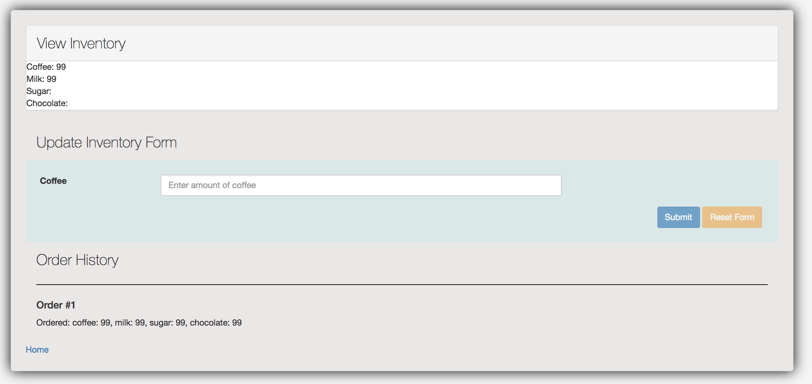

# Angular

[AngularJS](https://angularjs.org/) is a JavaScript framework to simplify the development of dynamic web applications by using declarative html annotations that bind to models declared in JavaScript.

Note: We are using Angular version 1.  There are later versions of Angular, but they involve a much more complicated configuration.  To simplify configuration and increase stability, we decided to go with an earlier version.

For this workshop, we'll first discuss concepts related to angular, and then work on tasks for updating an incomplete version of the coffeemaker app, in order to better understand angular.



## Concepts

Angular 1 essentially supports a [MVVM (Model-View-ViewModel) architecture](https://msdn.microsoft.com/en-us/library/hh848246.aspx), essentially, a UI architecture where changes are synchronized between the view and model using *databinding*, an automatic way of updating the view whenever the model changes, as well as updating the model whenever the view changes. A **ViewModel** serves as an intermediary, allowing presentation state and behavior to react to changes in the view or model. This is distinct from other frameworks such as, React and Angular 2, which adopt a component-based model architecture.

### Databinding

To implement a databindings in a view, annotations (via html tag attributes) are added to html.

```html
Coffee: <span id="currentCoffee" ng-bind="ctrl.inventoryMaster.coffee"></span><br /> 
Milk: <span id="currentMilk" ng-bind="ctrl.inventoryMaster.milk"></span><br />
```

For example, the `ng-bind` attribute, will tell Angular to set the value of "currentCoffee" span's text node, to be equal to the value of `ctrl.inventoryMaster.coffee`. If that value is updated in the ViewModel, then the span's text will be updated and vice versa.

Databinding to inputs in HTML Forms can be more complicated. Here is an example for binding to the input field for coffee. There are multiple features being handled by angular: detection of input changes (dirty state), error validation, and error feedback.

```html
<div class="form-group col-md-12">
    <label class="col-md-2 control-label" for="file">Coffee</label>
    <div class="col-md-7">
        <input type="text" ng-model="ctrl.inventory.coffee"
            name="coffee" class="coffee form-control input-sm"
            placeholder="Enter amount of coffee" required="0" />
        <div class="has-error" ng-show="addInventoryForm.$dirty">
            <span ng-show="addInventoryForm.coffee.$error.required">This
                is a required field</span> <span
                ng-show="addInventoryForm.coffee.$error.min">Minimum
                amount is 0</span> <span ng-show="addInventoryForm.coffee.$invalid">This
                field is invalid </span>
        </div>
    </div>
</div>
```

**EXERCISE**: Update the index.html to input milk.

### Page annotations

Angular provides other annotations to help manage the application's behavior.

The main functionality of the page is between the `body` tags. The opening `body` tag contains `ng-app`, which means that the JavaScript is active over the given portion of the code enclosed by the tag.  By putting `ng-app` in `body`, the entire page is enabled for JavaScript.  Setting the `class` attribute to `ng-cloak` means that the raw HTML will not be displayed in it's un-compiled form.  This reduces a flicker effect while the page loads.

```html
<body ng-app="myApp" class="ng-cloak">
```

Below is a description of the various Angular attributes:

  * [`ng-contoller`](https://docs.angularjs.org/api/ng/directive/ngController): Adds a controller that's defined in JavaScript.  `ctrl` is the name used in the rest of the page to refer to the controller.
  * [`ng-submit`](https://docs.angularjs.org/api/ng/directive/ngSubmit): connects the submit action of a form to a function in the controller.
  * [`ng-model`](https://docs.angularjs.org/api/ng/directive/ngModel): connects an input field to a field in the controller.
  * [`ng-show`](https://docs.angularjs.org/api/ng/directive/ngShow): determines if an element is displayed or not.  In the example here, the error message will only show if the form is `$dirty` (or has been interacted with by a user).  The error message displayed depends on if there was an `$error` or `$invalid` input.
  * [`ng-disabled`](https://docs.angularjs.org/api/ng/directive/ngDisabled): disables an element from editing by a user.  In this example, the Submit button is disabled if there are invalid inputs.  The Reset Form button is disabled if the form is `$pristine` where the user hasn't yet interacted with it.

### Angular Controller/Code-Behind

Databinding is a two-way process. We must also ensure that the ViewModel has the correct implementation. Sometimes this is referred to as the 
*code-behind* a view.

To create a controller, we can do the following:

```javascript
angular.module('myApp').controller('InventoryController', ['$scope', 'InventoryService', function($scope, InventoryService) {
```

A controller can store the view model's properties:

```javascript
   self.inventoryMaster = {coffee:'', milk:'', sugar:'', chocolate:''};
```

And can provide logic for updating the properties:

```javascript
   function getInventory(){
           InventoryService.getInventory()
           .then(
           function(data) {
               self.inventoryMaster = data;
           },
           function(errResponse){
               console.error('Error while getting Inventory');
           }
       );
   }
```

### Service/Mocking

In addition to a controller, you will need a service provider, which provides your controller with values from your model (db). Usually, this is implemented as http requests to a REST API. 

Because JavaScript can have asynchronous method calls, we need a way to have code that responses to events. One method is to use *promises*, which are objects with a callback that can be used to handle asynchronous methods. Angular, uses `$q`, which provides a promise implementation that can be either resolved (completed) or rejected (error).

```javascript
   function getInventory() {
       var deferred = $q.defer();
       $http.get(REST_SERVICE_URI)
           .then(
           function (response) {
               deferred.resolve(response.data);
           },
           function(errResponse){
               console.error('Error while getting inventory');
               deferred.reject(errResponse);
           }
       );
       return deferred.promise;
   } 
```

When building new angular pages, you may not yet have a fully functional REST service working. Indeed, this code is currently using a mock implementation of a REST service, using [`$httpBackend`](https://chariotsolutions.com/blog/post/angularjs-corner-ngmock-ngmocke2e-libraries/) which enables you to work on a web page until a real REST service is ready. This essentially will listen for requests to certain pages, and return back mock objects in response.

```javascript
   var mockInventory = {coffee: 99, milk: 99};
   $httpBackend.whenRoute('GET', '/api/v1/inventory')
   .respond(function(method, url, data, headers, params) {
     return [200, mockInventory];
   });
```

To switch to the real REST service, simply comment out the mock response calls.

## Workshop Tasks

1. Update the index.html to allow add display and input bindings for sugar, and chocolate. NOTE: You will also need to update inventory_service.js to update to mockInventory to handle retrieving and setting sugar and chocolate.

2. Extend the implementation of "Order History". Whenever the user adds a new order, update the orders list in inventory_service.js to store a string, so that the order history can be displayed as such:

   * Ordered: coffee: 99, milk: 99, sugar: 99, chocolate: 99
   * Ordered: coffee: 1, milk, 1, sugar, 1, chocolate: 1

## CoffeeMaker: Edit Recipe Task

The angular templates for CoffeeMaker are in `src/main/resources/templates/`.  You can examine the `recipe.html` template which supports the add recipe functionality as a source of inspiration for the edit recipe functionality.

After this workshop, you should be able to extend CoffeeMaker to have a new Edit Recipe Form, using angular, by creating an initial mock service implementation, before you complete a REST service for retrieving the real values from the database.

